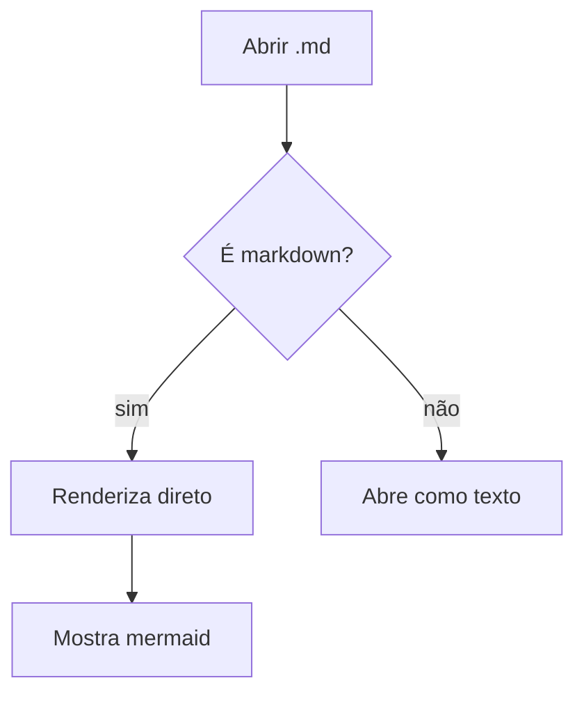
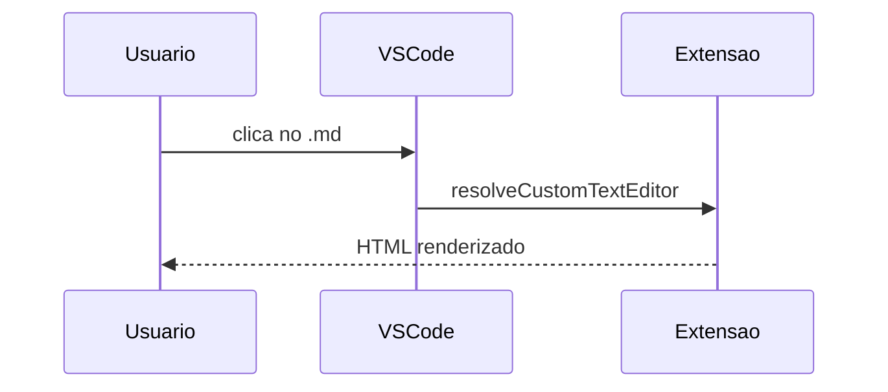

# Teste MD Preview

Isto é um **teste** da extensão. Suporta `código inline`, listas e tabelas.

- item 1
- item 2

| Coluna | Valor |
|--------|-------|
| a      | 1     |
| b      | 2     |

## Diagrama Mermaid

## Sequence

